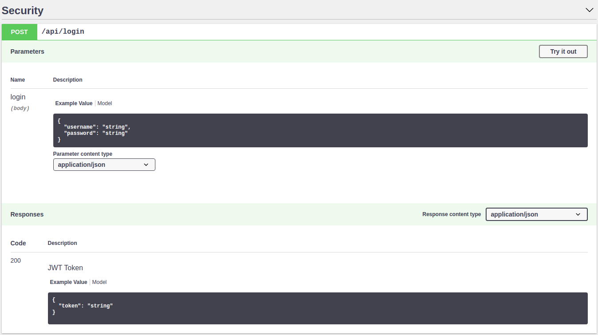
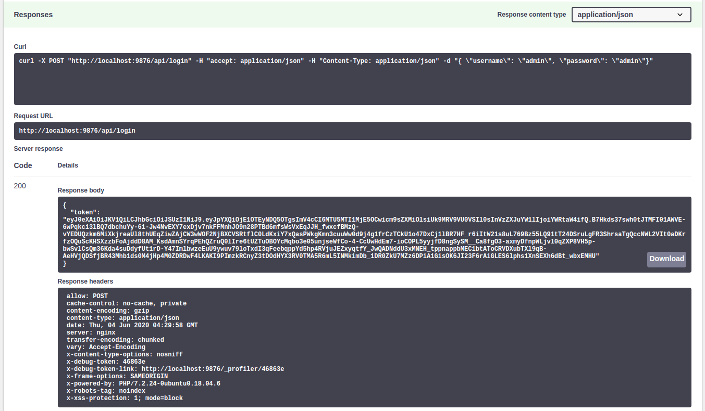
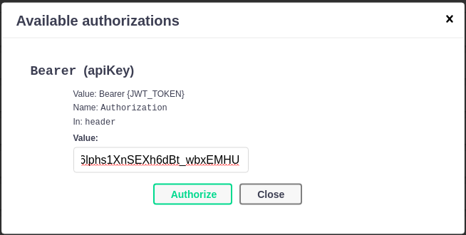

# Authentifikasi pada Semart Api Skeleton

## Pengantar

> 
> Semart Api Skeleton menggunakan [JWT](https://en.wikipedia.org/wiki/JSON_Web_Token) untuk mengidentifikasi pengguna. JWT dikirim via header `Authorization` dengan tipe `Bearer`.
>

## Masuk ke Aplikasi

> 
> Untuk masuk ke aplikasi Kamu bisa menggunakan sandbox pada bagian *Security* seperti gambar dibawah dengan menggunakan user `admin` dan password `admin`.
>

>
> Kamu akan mendapatkan response berupa JWT token dengan format `{ "token": [TOKEN] }` sebagai berikut:
>

>
> Copy isi dari `token` kemudian klik *Icon Gembok* sehingga muncul pop up sebagai berikut:
>

>
> Isikan dengan `Bearer [TOKEN]` seperti gambar di atas lalu klik *Authorize* maka request kamu selanjutnya akan secara otomatis membawa token tersebut
>
