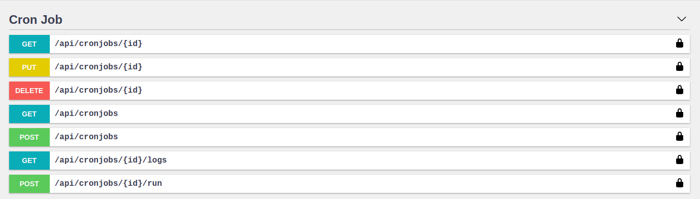

# Semart Api Skeleton *Cron* Manajemen

## Pengantar

Cronjob biasanya diatur pada level sistem operasi, namun pada [Semart Api Skeleton](https://github.com/KejawenLab/SemartApiSkeleton) cronjob dapat diatur langsung melalui aplikasi.

Bila Kamu melakukan instalasi menggunakan *Docker*, maka secara otomatis *cron manager daemon* akan aktif, Kamu dapat menggunakan perintah `docker-compose exec app bash -c "supervisorctl"` untuk memastikannya.

## *Cron* pada Semart Api Skeleton

*Cron* pada Semart Api Skeleton adalah semua perintah yang dapat dijalankan melalui *command line interface*. Khusus untuk Symfony *Command*, Kamu cukup menggunakan nama dari *command* tersebut saja.

Misalnya perintah `php bin/console semart:cron:clean`, maka Kamu cukup mendaftarkan sebagai `semart:cron:clean` dan menandainya sebagai Symfony *Command* (`symfonyCommand: true`) pada saat mendaftarkan *cron job*.

## Manajemen *Cron* pada Semart Api Skeleton

Kamu dapat menggunakan api berikut untuk mendaftarkan, memperbarui, menjalankan dan melihat *log* atau *output* dari *cron job* yang terdaftar.

