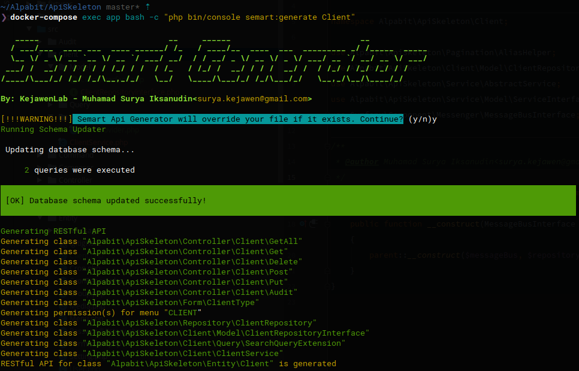
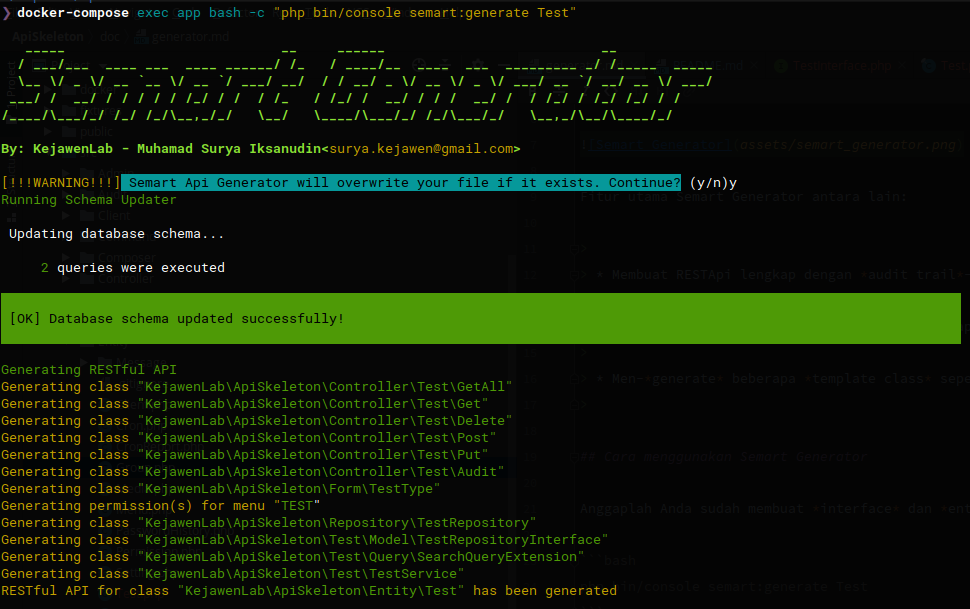
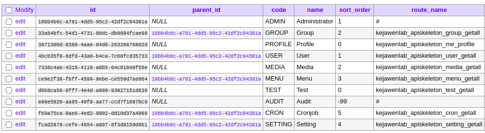

# Semart Api Generator

## Pengantar

Salah satu fitur utama dari Semart Api Skeleton adalah Semart Generator, yaitu sebuah alat bantu (*tool*) untuk membuat RESTApi serta dokumentasinya secara cepat.



Fitur utama Semart Generator antara lain:

>
> * Membuat RESTApi lengkap dengan *audit trail*-nya
>
> * Melakukan mapping menu dan hak akses terhadap RestApi yang di-*generate*
>
> * Men-*generate* beberapa *template class* seperti *form* dan *query extension class* agar mudah dimodifikasi
>

## Cara menggunakan Semart Generator

Anggaplah Anda sudah membuat *interface* dan *entity* sebagaimana pada halaman [README.md](../README.md#cara-penggunaan), maka Anda cukup menjalankan perintah sebagai berikut:

```bash
php bin/console semart:generate Test
```

Bila Anda menggunakan Docker, maka Anda dapat menjalankan perintah:

```bash
docker-compose exec app bash -c "php bin/console semart:generate Test"
```

Ketika muncul pertanyaan, Anda cukup memilih `y` maka hasilnya adalah sebagai berikut:



Dari *output* tersebut terlihat jelas apa saja *file* yang di-*generate*. Selain itu juga, Semart Generator akan mendaftarkan menu baru sesuai dengan *entity* yang di-*generate* sebagai berikut:



Sangat mudah sekali, bukan?
