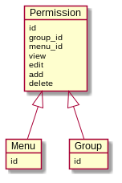

# *Permission* pada Semart Api Skeleton

## Pengantar

Bila Kamu sudah pernah menggunakan [SemartSkeleton](https://github.com/KejawenLab/SemartSkeleton) sebelumnya, pasti tidak asing dengan konsep *permission* pada [SemartApiSkeleton](https://github.com/KejawenLab/SemartApiSkeleton) karena mengusung konsep yang sama.

Secara sederhana, konsep *permission* pada Semart Api Skeleton dapat digambarkan sebagai berikut:



Bila Kamu menggunakan [Semart Generator](generator.md), secara otomatis menu (sesuai dengan nama *entity*) akan ditambahkan pada *database*, kemudian *permission* akan ditambahkan pada semua *group* yang ada pada *database* dengan *permission* `false` per *action* sebagai *default*. 

Kecuali untuk *group Super Admin* maka akan di-*set* `true` pada semua *action*-nya. Untuk mengetahui *group Super Admin*, Kamu dapat melihatnya pada *file* `.env` yaitu nilai dari `APP_SUPER_ADMIN`.

## Mendapatkan *Permission* sesuai *User Login*

Untuk mendapat *list permission* sesuai dengan *User Login*, Kamu dapat mengakses-nya via `/api/me/menus` dengan *response* sebagai berikut:

```json
[
  {
    "id": "dddea740-ca99-4cdd-8acc-b5bbca6040bd",
    "code": "PROFILE",
    "name": "Profile",
    "path": "/api/me",
    "extra": null
  },
  {
    "id": "5d7d287a-5df2-4860-8662-8457da16e06a",
    "code": "ADMIN",
    "name": "Administrator",
    "path": "#",
    "extra": null,
    "childs": [
      {
        "id": "075aaf72-9318-4955-b906-26200a3cd972",
        "code": "USER",
        "name": "User",
        "path": "/api/users",
        "extra": null
      },
      {
        "id": "1cab6699-ac54-4e8c-9465-6d11309cd12b",
        "code": "GROUP",
        "name": "Group",
        "path": "/api/groups",
        "extra": null
      },
      {
        "id": "3040cec9-d498-4c37-9080-4c210e238b85",
        "code": "MENU",
        "name": "Menu",
        "path": "/api/menus",
        "extra": null
      },
      {
        "id": "e05f3795-bb50-4556-8da5-54ed935974a1",
        "code": "SETTING",
        "name": "Setting",
        "path": "/api/settings",
        "extra": null
      },
      {
        "id": "756c9baa-2519-4e98-8683-6364b7d094cc",
        "code": "CRON",
        "name": "Cronjob",
        "path": "/api/cronjobs",
        "extra": null
      }
    ]
  },
  {
    "id": "6ab82c75-f924-490e-bbb1-1dd104d5240f",
    "code": "MEDIA",
    "name": "Media",
    "path": "/api/medias",
    "extra": null
  }
]
```

*Response* di atas adalah *list* menu yang dapat diakses oleh *User* yang sedang *login* tersebut aturan `$permission->isAddable() || $permission->isEditable() || $permission->isViewable()`. Artinya, selama *User* mendapatkan salah satu dari tiga *permission* tersebut pada sebuah menu, maka Semart Api Skeleton menganggap *User* berhak untuk melihat menu tersebut.

## Meng-*update Permission*

Untuk meng-*update Permission*, Kamu dapat menggunakan *endpoint* `/api/groups/{id}/permissions` dengan *method* `PUT`.
