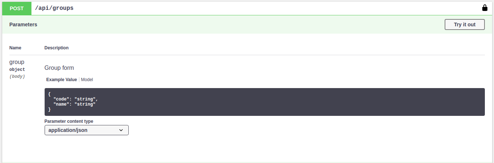

# Sandbox Semart Api Skeleton

## Pengantar

>
> Semart Api Skeleton secara otomatis membuatkan Dokumentasi Api sesuai spesifikasi [OpenApi](https://swagger.io/) menggunakan [NelmioApiDoc](https://symfony.com/doc/master/bundles/NelmioApiDocBundle/index.html)
>

## Sandbox URL

>
> Untuk merubah default sandbox URL, Anda dapat melakukannya dengan mengubah konfigurasi NelmioApiDoc pada file `config/packages/nelmio_api_doc.yaml` sebagai berikut:
>

```yaml
nelmio_api_doc:
    documentation:
        servers:
          - url: http://api.example.com/unsafe
            description: API over HTTP
          - url: https://api.example.com/secured
            description: API over HTTPS
```

## Menggunakan Sandbox

> 
> Untuk menggunakan cukup menekan tombol `Try it out` kemudian mengisikan parameter sesuai dengan yang tercantum pada Sandbox
>
> *NB:* Bila menemui kendala `401 Unauthorized` Anda dapat melakukan login terlebih dahulu
>

## Request Format



>
> NelmioApiDoc menggunakan annotation `@Swagger\Annotations\Parameter()` untuk membuat request format pada Sandbox
>
> *NB:* Anda dapat membaca dan melihat penggunaan annotation tersebut pada folder `Controller`
>

## Response Format

>
> NelmioApiDoc menggunakan annotation `@Swagger\Annotations\Response()` untuk membuat request format pada Sandbox
>
> *NB:* Anda dapat membaca dan melihat penggunaan annotation tersebut pada folder `Controller`
>

## Extra

>
> Bila Anda bingung menggunakan tentang parameter yang tersedia pada masing-masing annotation, coba kunjungi halaman [Spesifkasi OpenApi](https://swagger.io/docs/specification/about/)
>
