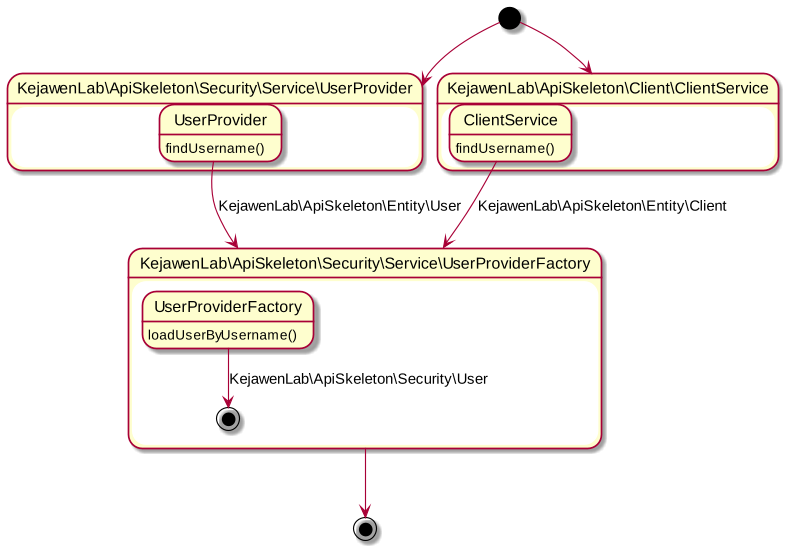

# Tambah Tipe User

## Pengantar

Semart Api Skeleton menggunakan paradigma yang berbeda dalam memanage user. Hal ini dilakukan agar lebih fleksibel dalam memanage user. User utama pada Semart Api Skeleton adalah `KejawenLab\ApiSkeleton\Security\User`. Semua User pada aplikasi, nantinya akan diganti dengan *object* dari *class* tersebut.

Secara *state diagram*, kondisi saat ini dapat digambarkan sebagai berikut:

## Menambah Tipe User Baru

 
